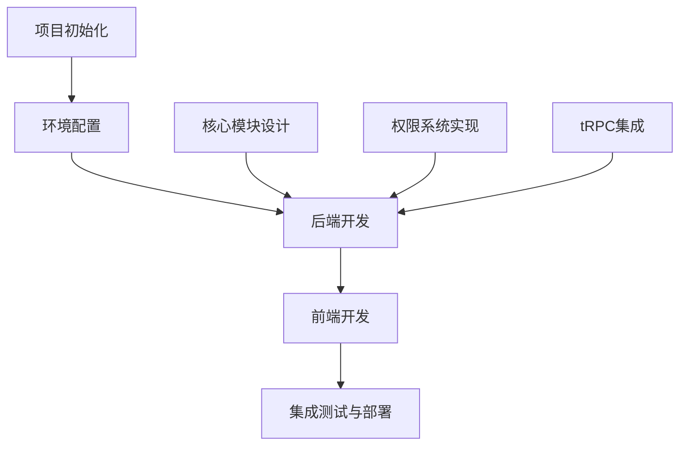

# Nest-tRPC-Prisma-Starter 项目复刻规划

## 项目概述

这是一个使用NestJS、tRPC、Prisma和Zod构建的现代化全栈应用程序，具有以下特点：

- **类型安全**: 通过NestJS + tRPC提供完整的类型安全方案
- **现代化ORM**: 使用Prisma进行数据库操作
- **简化验证**: 用Zod替代class-validator简化验证
- **复杂权限管理**: 使用CASL.js实现细粒度的权限控制

项目采用Monorepo结构，包含三个主要部分：
- 服务器端(apps/server): 使用NestJS + tRPC + Prisma
- 管理界面(apps/admin): 使用Ant Design Pro
- Web前端(apps/web): 使用Next.js

## 复刻规划



## 一、项目初始化与环境配置

### 1. 基础项目结构

```bash
mkdir my-nest-trpc-project
cd my-nest-trpc-project
pnpm init
```

创建工作空间配置文件 `pnpm-workspace.yaml`:

```yaml
packages:
  - 'apps/*'
  - 'packages/*'
```

创建目录结构:

```bash
mkdir -p apps/server apps/admin apps/web packages/database
```

### 2. 环境变量配置

创建 `.env` 文件:

```
# app
APP_NAME=my-nest-trpc-project
APP_PORT=5001
APP_BASE_URL=http://localhost:5001

# logger
LOGGER_LEVEL=debug

# security
JWT_SECRET=mySecretKey123
JWT_EXPIRE=7d

# db
POSTGRES_USER=postgres
POSTGRES_PASSWORD=your_password
POSTGRES_DB=my_db

DB_HOST=127.0.0.1
DB_PORT=5432

DATABASE_URL=postgresql://${POSTGRES_USER}:${POSTGRES_PASSWORD}@${DB_HOST}:${DB_PORT}/${POSTGRES_DB}?schema=public

# redis
REDIS_PORT=6379
REDIS_HOST=127.0.0.1
REDIS_PASSWORD=
REDIS_DB=0

# smtp (可选)
SMTP_HOST=smtp.example.com
SMTP_PORT=465
SMTP_USER=your_email
SMTP_PASS=your_password
```

## 二、后端架构实现（重点）

### 1. 数据库设计

在 `packages/database/schema.prisma` 创建以下模型:

```prisma
// schema.prisma
generator client {
  provider = "prisma-client-js"
  output   = "./client"
}

datasource db {
  provider = "postgresql"
  url      = env("DATABASE_URL")
}

model User {
  id        String   @id @default("")
  username  String   @unique() @db.VarChar(80)
  password  String   @db.VarChar(80)
  avatar    String   @db.VarChar(1024)
  email     String?  @unique() @db.VarChar(80)
  status    Int?     @default(1) @db.SmallInt
  createdAt DateTime @default(now()) @map("created_at") @db.Timestamptz(6)
  updatedAt DateTime @updatedAt @map("updated_at")
  role      Role     @default(User)
  todos     Todo[]
}

model Todo {
  id        String   @id @default("")
  value     String
  status    Boolean  @default(false)
  createdAt DateTime @default(now()) @map("created_at") @db.Timestamptz(6)
  updatedAt DateTime @updatedAt @map("updated_at")
  user      User     @relation(fields: [userId], references: [id], onDelete: Cascade)
  userId    String
}

enum Role {
  Admin
  User
}
```

生成Prisma客户端并添加Zod生成器配置。

### 2. NestJS核心模块架构

#### 2.1 模块化结构

NestJS应用使用模块化结构组织代码:

```
src/
├── app.module.ts              # 应用主模块
├── main.ts                    # 应用入口
├── common/                    # 公共组件  
│   ├── decorators/           # 自定义装饰器
│   ├── dto/                  # 数据传输对象
│   ├── exceptions/           # 异常处理
│   ├── filters/              # 异常过滤器
│   ├── interceptors/         # 拦截器
│   ├── pipes/                # 管道
│   └── ...
├── config/                    # 配置
├── constants/                 # 常量
├── global/                    # 全局设置
├── helper/                    # 辅助函数
├── modules/                   # 业务模块
│   ├── auth/                 # 认证模块
│   ├── casl/                 # 权限模块
│   ├── user/                 # 用户模块
│   ├── todo/                 # Todo模块
│   └── ...
├── shared/                    # 共享模块
│   ├── database/             # 数据库模块
│   ├── redis/                # Redis模块
│   ├── trpc/                 # tRPC模块
│   └── ...
└── utils/                     # 工具函数
```

#### 2.2 依赖注入设计

NestJS使用依赖注入系统实现服务和组件之间的松耦合:

```typescript
// 服务示例
@Injectable()
export class TodoService {
  constructor(
    @InjectPrismaClient()
    private readonly prisma: ExtendedPrismaClient,
    private readonly logger: LoggerService,
  ) {}
  
  // 服务方法...
}

// 控制器示例
@Controller('todos')
export class TodoController {
  constructor(private readonly todoService: TodoService) {}
  
  // 路由处理...
}
```

#### 2.3 模块集成示例

```typescript
// todo.module.ts
@Module({
  imports: [CaslModule],
  controllers: [TodoController],
  providers: [
    TodoService,
    TodoTrpcRouter,
    TodoAbility,
  ],
  exports: [TodoService],
})
export class TodoModule {}
```

### 3. 权限系统实现（核心重点）

#### 3.1 CASL权限架构

权限系统基于CASL库实现，主要组件:

1. **能力定义** (`ability.class.ts`):
```typescript
export enum Action {
  Manage = 'manage',
  Create = 'create',
  Read = 'read',
  Update = 'update',
  Delete = 'delete',
}

export type PrismaSubjects = {
  User: User
  Todo: Todo
}

export type AppAbility = PureAbility<[Action, Subjects<PrismaSubjects>]>

export abstract class BaseAbility {
  abstract createForUser(user: IAuthUser): AppAbility
}
```

2. **能力工厂装饰器** (`ability.decorator.ts`):
```typescript
export const ABILITY_FACTORY_KEY = Symbol('ABILITY_FACTORY_KEY')

export function DefineAbility(model: ModelName): ClassDecorator {
  return (target) => {
    Reflect.defineMetadata(ABILITY_FACTORY_KEY, model, target)
  }
}
```

3. **能力服务** (`casl.service.ts`):
```typescript
@Injectable()
export class AbilityService implements OnModuleInit {
  constructor(
    private readonly discovery: DiscoveryService,
    private readonly reflector: Reflector,
  ) {}

  abilityMap: Record<ModelName, BaseAbility>

  onModuleInit() {
    this.createAbility()
  }

  private createAbility() {
    const providers = this.discovery.getProviders()
    const abilityMap = {}

    providers.forEach((provider) => {
      try {
        const model = this.reflector.get(ABILITY_FACTORY_KEY, provider.metatype)
        if (model)
          abilityMap[model] = provider.instance
        return model
      }
      catch {}
    })

    this.abilityMap = abilityMap as Record<ModelName, BaseAbility>
    return abilityMap
  }
}
```

#### 3.2 模型特定权限实现

每个模型都有自己的权限实现，例如Todo模型:

```typescript
@DefineAbility('Todo')
@Injectable()
export class TodoAbility implements BaseAbility {
  createForUser(user: IAuthUser) {
    const { can, build } = new AbilityBuilder<AppAbility>(createPrismaAbility)

    if (user.role === Role.Admin)
      can(Action.Manage, 'Todo')

    if (user.role === Role.User) {
      can(Action.Create, 'Todo')
      can(Action.Read, 'Todo', { userId: user.id })
      can(Action.Update, 'Todo', { userId: user.id })
      can(Action.Delete, 'Todo', { userId: user.id })
    }

    return build()
  }
}
```

#### 3.3 策略守卫实现

```typescript
@Injectable()
export class PolicyGuard implements CanActivate {
  constructor(
    private reflector: Reflector,
    private abilityService: AbilityService,
    @InjectPrismaClient()
    private readonly prisma: ExtendedPrismaClient,
  ) {}

  async canActivate(context: ExecutionContext): Promise<boolean> {
    const request = context.switchToHttp().getRequest<FastifyRequest>()
    const { user } = context.switchToHttp().getRequest()

    if (!user)
      throw new UnauthorizedException()

    const policy = this.reflector.getAllAndOverride<PolicyObject>(CHECK_POLICY_KEY, [
      context.getHandler(),
      context.getClass(),
    ])

    if (!policy)
      throw new BizException(ErrorCodeEnum.NoPermission)

    const { action, model } = policy
    const ability = this.abilityService.abilityMap[model].createForUser(user)

    // 获取请求资源的id
    const id = getRequestItemId(request)

    // 如果id存在，则检查具体资源
    if (id) {
      const item = await this.prisma[model].findUniqueOrThrow({
        where: { id },
      })

      return ability.can(action, subject(model, item))
    }

    return ability.can(action, model)
  }
}
```

#### 3.4 策略装饰器实现

```typescript
export const CHECK_POLICY_KEY = Symbol('CHECK_POLICY_KEY')

export interface PolicyObject {
  action: Action
  model: ModelName
}

export function Policy(policy: PolicyObject): MethodDecorator {
  return (target, key, descriptor) => {
    Reflect.defineMetadata(CHECK_POLICY_KEY, policy, descriptor.value)
    return descriptor
  }
}
```

#### 3.5 控制器中应用权限

```typescript
@Controller('todos')
@UseGuards(JwtAuthGuard, PolicyGuard)
export class TodoController {
  constructor(private readonly todoService: TodoService) {}

  @Get(':id')
  @Policy({ model: 'Todo', action: Action.Read })
  async findOne(@Param() { id }: IdDto) {
    return this.todoService.findOne(id)
  }

  @Post()
  @Policy({ model: 'Todo', action: Action.Create })
  async create(@Body() dto: TodoDto, @AuthUser() user: IAuthUser) {
    return this.todoService.create(dto, user.id)
  }

  // 其他路由...
}
```

### 4. tRPC集成

#### 4.1 tRPC服务设计

tRPC服务整合了NestJS的依赖注入系统:

```typescript
@Injectable()
export class TRPCService implements OnModuleInit {
  constructor(
    private readonly discovery: DiscoveryService,
    private readonly reflector: Reflector,
    private readonly authService: AuthService,
    private readonly abilityService: AbilityService,
    @InjectPrismaClient()
    private readonly prisma: ExtendedPrismaClient,
  ) {
    // 初始化procedureAuth中间件
    this._procedureAuth = trpc.procedure
      // auth middleware
      .use(
        trpc.middleware(async (opts) => {
          const authorization = opts.ctx.req.headers?.authorization
          if (!authorization)
            throw new BizException(ErrorCodeEnum.AuthFail)

          const result = await authService.validateToken(authorization)
          if (!result)
            throw new BizException(ErrorCodeEnum.JWTInvalid)

          opts.ctx.user = result

          return opts.next()
        }),
      )
      // policy middleware
      .use(trpc.middleware(async (opts) => {
        const { rawInput, ctx: { user }, meta } = opts

        if (meta) {
          const { action, model } = meta
          const ability = this.abilityService.abilityMap[model].createForUser(user)

          const id = (rawInput as { id: string }).id

          if (id) {
            const item = await this.prisma[model].findUniqueOrThrow({
              where: { id },
            })

            const result = ability.can(action, subject(model, item))
            if (!result)
              throw new BizException(ErrorCodeEnum.ResourceNotFound)
          }

          const result = ability.can(action, model)
          if (!result)
            throw new BizException(ErrorCodeEnum.NoPermission)
        }

        return opts.next()
      }))
  }

  // 其他方法...
}
```

#### 4.2 路由发现机制

自动发现和注册所有tRPC路由:

```typescript
onModuleInit() {
  this.createAppRouter()
}

private createAppRouter() {
  const providers = this.discovery.getProviders()
  const routers = providers
    .filter((provider) => {
      try {
        return this.reflector.get(TRPC_ROUTER, provider.metatype)
      }
      catch {
        return false
      }
    })
    .map(({ instance }) => instance.router)
    .filter((router) => {
      if (!router)
        this.logger.warn('missing router.')

      return !!router
    })

  const appRouter = trpc.mergeRouters(...(routers as any as Routers))
  this.appRouter = appRouter
  return appRouter
}
```

#### 4.3 实现模块化tRPC路由

示例 - Todo模块的tRPC路由:

```typescript
@TRPCRouter()
@Injectable()
export class TodoTrpcRouter implements OnModuleInit {
  private router: ReturnType<typeof this.createRouter>

  constructor(
    private readonly trpcService: TRPCService,
    private readonly todoService: TodoService,
  ) {}

  onModuleInit() {
    this.router = this.createRouter()
  }

  private createRouter() {
    const procedureAuth = this.trpcService.procedureAuth
    return defineTrpcRouter('todo', {
      list: this.trpcService.procedureAuth
        .input(TodoPagerDto.schema)
        .meta({ model: 'Todo', action: Action.Read })
        .query(async (opt) => {
          const { input, ctx: { user } } = opt
          return this.todoService.list(input, user.id)
        }),
      byId: procedureAuth
        .input(IdDto.schema)
        .meta({ model: 'Todo', action: Action.Read })
        .query(async (opt) => {
          const { input } = opt
          const { id } = input
          return this.todoService.findOne(id)
        }),
      // 其他tRPC方法...
    })
  }
}
```

#### 4.4 中间件集成

将tRPC集成到NestJS HTTP服务器:

```typescript
applyMiddleware(_app: NestFastifyApplication) {
  _app.getHttpAdapter().all(`/api/trpc/:path`, async (req, res) => {
    const path = (req.params as any).path
    await fastifyRequestHandler({
      router: this.appRouter,
      createContext,
      req: req as unknown as FastifyRequest,
      res: res as unknown as FastifyReply,
      path,
      onError: (opts) => {
        const { error, path } = opts
        this.logger.error(`Error in tRPC handler on path '${path}: ${error.message}`, error.stack)
      },
    })
  })

  // 设置tRPC playground
  nextTick(async () => {
    _app.register(
      await getFastifyPlugin({
        router: this.appRouter,
        trpcApiEndpoint: '/api/trpc',
        playgroundEndpoint: '/api/trpc-playground',
      }) as any,
      { prefix: '/api/trpc-playground' },
    )
  })
}
```

### 5. Zod验证系统

#### 5.1 基于Zod的DTO设计

```typescript
// todo.dto.ts
export class TodoDto {
  static schema = z.object({
    value: z.string(),
    status: z.boolean().optional(),
  })

  value: string
  status?: boolean
}

export class TodoPagerDto extends PagerDto {
  static schema = PagerDto.schema.extend({
    status: z.boolean().optional(),
  })

  status?: boolean
}

export const TodoInputSchema = TodoDto.schema
```

#### 5.2 Zod验证管道

```typescript
@Injectable()
export class ZodValidationPipe implements PipeTransform {
  constructor(private schema: ZodSchema) {}

  transform(value: unknown) {
    try {
      return this.schema.parse(value)
    }
    catch (error) {
      if (error instanceof ZodError) {
        throw new BadRequestException({
          message: 'Validation failed',
          errors: error.errors,
        })
      }
      throw error
    }
  }
}
```

## 三、前端开发（简化）

### 1. 管理界面

使用Ant Design Pro构建管理界面，集成后端API:

- 用户认证
- CRUD操作
- 权限控制

### 2. Web前端

使用Next.js构建Web前端，集成tRPC客户端:

- tRPC客户端配置
- 用户认证
- Todo应用实现

## 四、实施步骤

### 1. 第一阶段：环境搭建与基础设置

- 初始化项目结构
- 配置环境变量
- 设置数据库

### 2. 第二阶段：后端核心实现

- 实现数据库模型
- 构建核心模块架构
- 实现权限系统
- 集成tRPC

### 3. 第三阶段：前端实现

- 搭建管理界面
- 开发Web前端
- 集成API

### 4. 第四阶段：测试与部署

- 单元测试
- 集成测试
- 部署配置

## 五、开发建议

1. **增量开发**: 先完成基础架构，逐步实现功能
2. **测试驱动**: 编写测试确保功能正确性
3. **模块化原则**: 保持模块职责单一
4. **文档记录**: 为重要组件添加文档
5. **代码审查**: 定期检查代码质量